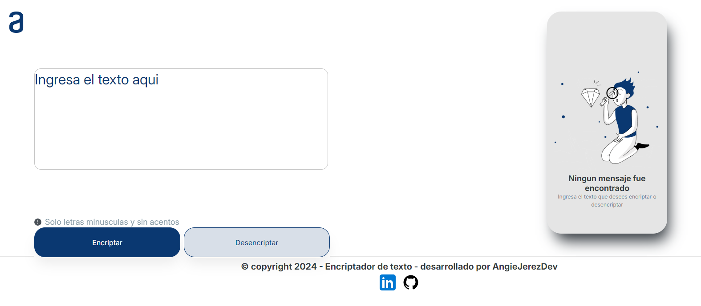

# 🔒 Encriptador de Texto

¡Bienvenido al proyecto de **Encriptador de Texto**! Este es un sencillo pero poderoso encriptador que convierte tu texto en un formato codificado para mantener la información segura. 🛡️

## 🚀 ¿Cómo funciona?

- **Encriptar:** Convierte las vocales en tu texto a códigos especiales.
- **Desencriptar:** Restaura el texto encriptado a su forma original.
- **Copiar:** Permite copiar el texto encriptado o desencriptado al portapapeles con un solo clic.

## 📋 Requisitos

- Navegador web moderno
- Solo letras minúsculas y sin acentos

## 🛠️ Uso

1. Ingresa el texto que deseas encriptar en el área de texto.
2. Haz clic en el botón **Encriptar** para convertir tu texto.
3. Para revertirlo, haz clic en el botón **Desencriptar**.
4. Usa el botón **Copiar** para copiar el resultado.

## 🖼️ Captura de Pantalla

## 🌐 Demo

Puedes ver una demostración en vivo del proyecto [aquí](https://github.com/AngieJerezDev/encriptador-de-texto).

## 📚 Tecnologías Usadas

- HTML
- CSS
- JavaScript

## 📜 Licencia

Este proyecto está bajo la Licencia MIT. Consulta el archivo `LICENSE` para más detalles.

## 👩‍💻 Desarrollado por

- [AngieJerezDev](https://github.com/AngieJerezDev)

## 🗒️ Notas

- Este encriptador está diseñado para funcionar solo con letras minúsculas y sin acentos. Asegúrate de seguir estas reglas para obtener mejores resultados. ⚠️
- El código es de código abierto y se agradecen las contribuciones. ¡No dudes en hacer un fork y contribuir con mejoras! ✨

---

¡Gracias por usar el Encriptador de Texto! Si tienes alguna pregunta o sugerencia, no dudes en abrir un issue o contactarme. 😊
